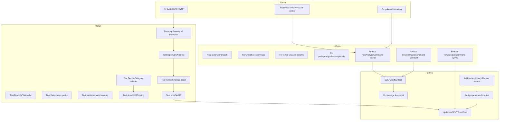

# Execution Plan — 2026-04-29 22:15

_Coverage 82.7% → 90%+, Lint 121 warnings → <20, CI green, All 0% functions tested_

---

## Pareto Analysis

### 1% that delivers 51% of the result

- Fix CI GOPRIVATE (existing CI fails without it)
- Suppress exhaustruct noise (~60 of 121 warnings)
- Cover mapSeverity branches (60% → 100%)
- Fix golines formatting (1 command)
- Test FromJSON invalid input

### 4% that delivers 64% of the result

- All 0% function tests (renderFindings, reportJSON, printSARIF, showDiffIfExisting)
- Reduce command complexity (gocognit 39, cyclop 14/13)
- Fix all real lint warnings (gosec, wrapcheck, revive, perfsprint)
- Cover DecideCategory default cases
- Cover Detect error paths
- Validate invalid severity test

### 20% that delivers 80% of the result

- E2E workflow test
- CI coverage threshold
- Version/Binary Runner seams for testability
- go:generate for rules
- Centralize plugin metadata

---

## Execution Graph

---

## 27 Tasks (30-100min each)

| #   | Task                                                      | Impact   | Effort | Category     |
| --- | --------------------------------------------------------- | -------- | ------ | ------------ |
| 1   | Fix CI: Add GOPRIVATE env var for go-finding              | CRITICAL | 10min  | CI           |
| 2   | Suppress exhaustruct noise for cobra.Command              | HIGH     | 15min  | Lint         |
| 3   | Fix golines formatting in cmd_analyze.go                  | MEDIUM   | 5min   | Lint         |
| 4   | Test mapSeverity: warn, info, advice, default branches    | HIGH     | 10min  | Coverage     |
| 5   | Test FromJSON with invalid JSON                           | MEDIUM   | 10min  | Coverage     |
| 6   | Test DecideCategory default/unknown category cases        | MEDIUM   | 10min  | Coverage     |
| 7   | Test Detect non-ExitError and ExitError-with-Stderr paths | HIGH     | 15min  | Coverage     |
| 8   | Test validate invalid severity detection                  | MEDIUM   | 10min  | Coverage     |
| 9   | Test reportJSON directly with io.Writer                   | HIGH     | 15min  | Coverage     |
| 10  | Test renderFindings directly with all format branches     | HIGH     | 20min  | Coverage     |
| 11  | Test showDiffIfExisting: existing, malformed, missing     | HIGH     | 15min  | Coverage     |
| 12  | Test printSARIF directly                                  | MEDIUM   | 15min  | Coverage     |
| 13  | Fix gosec G304 (file inclusion) and G306 (permissions)    | MEDIUM   | 15min  | Lint         |
| 14  | Fix wrapcheck: wrap CheckBinary/CheckVersion errors       | MEDIUM   | 10min  | Lint         |
| 15  | Fix revive: unused parameters (args, cmd) → underscore    | LOW      | 10min  | Lint         |
| 16  | Fix perfsprint and gochecknoglobals                       | LOW      | 10min  | Lint         |
| 17  | Reduce newAnalyzeCommand cyclop 14→<10                    | HIGH     | 30min  | Complexity   |
| 18  | Reduce newConfigureCommand gocognit 39→<30                | HIGH     | 30min  | Complexity   |
| 19  | Reduce newValidateCommand cyclop 13→<10                   | MEDIUM   | 30min  | Complexity   |
| 20  | E2E workflow test: configure→validate→report              | HIGH     | 45min  | Testing      |
| 21  | CI: Add coverage threshold (≥80%)                         | MEDIUM   | 15min  | CI           |
| 22  | Add Runner seam to version.go/fix.go for testability      | MEDIUM   | 30min  | Architecture |
| 23  | Add go:generate directive for rules update + test count   | LOW      | 20min  | DX           |
| 24  | Centralize plugin metadata in PluginDescriptor            | MEDIUM   | 45min  | Architecture |
| 25  | GPG signing config for tags                               | LOW      | 5min   | DX           |
| 26  | Update AGENTS.md with final state                         | LOW      | 15min  | Docs         |
| 27  | Final comprehensive status report                         | LOW      | 15min  | Docs         |

---

## 150 Micro-Tasks (max 15min each)

| #   | Micro-Task                                                            | Parent | Est   |
| --- | --------------------------------------------------------------------- | ------ | ----- |
| 1   | Add `env: GOPRIVATE` to CI test job                                   | 1      | 5min  |
| 2   | Add `env: GOPRIVATE` to CI lint job                                   | 1      | 5min  |
| 3   | Add exhaustruct exclude for cobra.Command in .golangci.yml            | 2      | 5min  |
| 4   | Add exhaustruct exclude for slog.HandlerOptions                       | 2      | 5min  |
| 5   | Add exhaustruct exclude for slog.Attr                                 | 2      | 5min  |
| 6   | Add exhaustruct exclude for exec.ExitError                            | 2      | 5min  |
| 7   | Run `gofmt -w` / `golines` on cmd_analyze.go                          | 3      | 5min  |
| 8   | Add TestMapSeverity: input="warn" → SeverityWarning                   | 4      | 3min  |
| 9   | Add TestMapSeverity: input="info" → SeverityInfo                      | 4      | 3min  |
| 10  | Add TestMapSeverity: input="advice" → SeverityInfo                    | 4      | 3min  |
| 11  | Add TestMapSeverity: input="unknown" → SeverityWarning (default)      | 4      | 3min  |
| 12  | Add TestMapSeverity: input="" → SeverityWarning (default)             | 4      | 3min  |
| 13  | Add TestFromJSONInvalid: malformed JSON returns error                 | 5      | 5min  |
| 14  | Add TestFromJSONInvalid: empty object returns empty config            | 5      | 5min  |
| 15  | Add TestDecideCategoryUnknown to profile_test.go                      | 6      | 5min  |
| 16  | Add TestDecideRecommendedUnknown to profile_test.go                   | 6      | 5min  |
| 17  | Add TestDetectNonExitError: mock returns generic error                | 7      | 5min  |
| 18  | Add TestDetectExitErrorWithStderr: mock returns ExitError with stderr | 7      | 5min  |
| 19  | Add TestValidateInvalidSeverity to commands_test.go                   | 8      | 5min  |
| 20  | Refactor reportJSON to accept io.Writer parameter                     | 9      | 5min  |
| 21  | Add TestReportJSONDirect: verify JSON output structure                | 9      | 10min |
| 22  | Refactor renderFindings to accept io.Writer for stdout/stderr         | 10     | 10min |
| 23  | Add TestRenderFindingsSummary: verify summary format                  | 10     | 5min  |
| 24  | Add TestRenderFindingsJSON: verify JSON output                        | 10     | 5min  |
| 25  | Add TestRenderFindingsTable: verify table output                      | 10     | 5min  |
| 26  | Add TestRenderFindingsSARIF: verify SARIF delegation                  | 10     | 5min  |
| 27  | Add TestRenderFindingsUnknownFormat: verify error                     | 10     | 3min  |
| 28  | Refactor showDiffIfExisting to return diff string instead of logging  | 11     | 5min  |
| 29  | Add TestShowDiffExisting: existing config shows diff                  | 11     | 5min  |
| 30  | Add TestShowDiffMalformed: malformed config logs warning              | 11     | 5min  |
| 31  | Add TestShowDiffMissing: no existing file is no-op                    | 11     | 5min  |
| 32  | Refactor printSARIF to accept io.Writer                               | 12     | 5min  |
| 33  | Add TestPrintSARIF: verify SARIF JSON output                          | 12     | 10min |
| 34  | Fix gosec G304: add nolint comment with justification                 | 13     | 5min  |
| 35  | Fix gosec G306: change test WriteFile to 0o600                        | 13     | 5min  |
| 36  | Wrap CheckBinary error in cmd_analyze.go                              | 14     | 3min  |
| 37  | Wrap CheckVersion error in cmd_configure.go                           | 14     | 3min  |
| 38  | Wrap json.MarshalIndent in cmd_report.go                              | 14     | 3min  |
| 39  | Rename 'args' → '\_' in cmd_analyze.go RunE                           | 15     | 2min  |
| 40  | Rename 'args' → '\_' in cmd_configure.go RunE                         | 15     | 2min  |
| 41  | Rename 'cmd' → '\_' in cmd_report.go RunE                             | 15     | 2min  |
| 42  | Rename 'cmd' → '\_' in cmd_validate.go RunE                           | 15     | 2min  |
| 43  | Fix perfsprint: fmt.Errorf → errors.New in cmd_root.go                | 16     | 3min  |
| 44  | Add nolint for gochecknoglobals on logSetupMu                         | 16     | 3min  |
| 45  | Extract format selection from newAnalyzeCommand to helper             | 17     | 10min |
| 46  | Extract pipeline setup from newAnalyzeCommand to helper               | 17     | 10min |
| 47  | Extract validate logic from newValidateCommand to Validate()          | 19     | 10min |
| 48  | Extract validate severity check to helper                             | 19     | 5min  |
| 49  | Extract validate unknown rules check to helper                        | 19     | 5min  |
| 50  | Verify newAnalyzeCommand cyclop < 10                                  | 17     | 5min  |
| 51  | Verify newConfigureCommand gocognit < 30                              | 18     | 5min  |
| 52  | Verify newValidateCommand cyclop < 10                                 | 19     | 5min  |
| 53  | Add package comment to internal/cli                                   | 17     | 3min  |
| 54  | Write E2E test: configure → validate → report roundtrip               | 20     | 15min |
| 55  | Write E2E test: configure with diff shows changes                     | 20     | 10min |
| 56  | Write E2E test: configure dry-run does not write file                 | 20     | 5min  |
| 57  | Add coverage threshold check to CI                                    | 21     | 10min |
| 58  | Add Runner seam to CheckVersion/CheckBinary                           | 22     | 15min |
| 59  | Add Runner seam to RunFix                                             | 22     | 10min |
| 60  | Add TestCheckVersionError with mock                                   | 22     | 5min  |
| 61  | Add TestCheckBinaryError with mock                                    | 22     | 5min  |
| 62  | Add TestRunFixError with mock                                         | 22     | 5min  |
| 63  | Add //go:generate comment to registry.go                              | 23     | 5min  |
| 64  | Write gen-rules tool that updates rules_data.json + test count        | 23     | 15min |
| 65  | Set tag.gpgsign=false in repo git config                              | 25     | 3min  |
| 66  | Update AGENTS.md with all changes from this session                   | 26     | 15min |
| 67  | Write final status report                                             | 27     | 15min |
| 68  | Add TestSetupLoggingVerboseQuietConflict                              | -      | 5min  |
| 69  | Add TestSetupLoggingVerboseSetsDebug                                  | -      | 5min  |
| 70  | Add TestSetupLoggingQuietSetsError                                    | -      | 5min  |
| 71  | Add TestCompactLogAttrStripsTime                                      | -      | 5min  |
| 72  | Add TestProfileNames returns all profiles                             | -      | 3min  |
| 73  | Add TestWriteDryRun outputs JSON                                      | -      | 5min  |
| 74  | Add TestConfigureWithFix (mock oxlint.RunFix)                         | -      | 10min |
| 75  | Add FindingView json tags for musttag linter                          | -      | 5min  |
| 76  | Add TestCompareAnyMapsUnmarshallable (channel value)                  | -      | 5min  |
| 77  | Add TestPrintFindingsJSONError (failing writer)                       | -      | 5min  |
| 78  | Add TestToJSONError (impossible but cover the branch)                 | -      | 5min  |
| 79  | Fix gosec G204 in detector.go (subprocess launch)                     | -      | 5min  |
| 80  | Add nolint for exhaustruct on Detector struct init                    | -      | 3min  |
| 81  | Add nolint for exhaustruct on finding.Position init                   | -      | 3min  |
| 82  | Verify all tests pass with -race                                      | -      | 5min  |
| 83  | Verify go vet passes                                                  | -      | 3min  |
| 84  | Run golangci-lint and count remaining warnings                        | -      | 5min  |
| 85  | Generate coverage report and verify ≥80%                              | -      | 5min  |
| 86  | Commit: CI GOPRIVATE fix                                              | -      | 3min  |
| 87  | Commit: Lint suppressions + fixes                                     | -      | 3min  |
| 88  | Commit: Coverage additions Phase 1                                    | -      | 3min  |
| 89  | Commit: Coverage additions Phase 2                                    | -      | 3min  |
| 90  | Commit: Complexity reductions                                         | -      | 3min  |
| 91  | Commit: E2E + CI hardening                                            | -      | 3min  |
| 92  | Commit: Architecture improvements                                     | -      | 3min  |
| 93  | Commit: Documentation update                                          | -      | 3min  |
| 94  | Push to origin                                                        | -      | 2min  |
| 95  | Verify CI passes on GitHub                                            | -      | 5min  |

---

_This plan covers all known gaps. Execute in order: Phase 1 → 2 → 3 → 4._
