# Architecture Audit & Improvement Plan

**Date:** 2026-04-29_22-48  
**Project:** oxlint-auto-configure  
**Status:** ✅ Complete (M01–M30, M25–M26 intentionally skipped)  

---

## 1. Brutal Honesty — What's Wrong

### 1a. What We Forgot / Did Wrong

| Issue | Severity | Details |
|-------|----------|---------|
| `mapCategory()` uses raw strings, not `rule.Plugin` | **CRITICAL** | Adding a new plugin requires updating `rule.Plugin` constants AND `mapCategory()` independently — no compile-time check. Split brain. |
| `validateSeverities()` hardcodes valid severities | **CRITICAL** | `map[string]bool{"error": true, "warn": true, "off": true}` instead of using `rule.SeverityDecision`. Adding a new severity requires updating two places. Split brain. |
| Two packages with same `Detector` type name | **HIGH** | `oxlint.Detector` vs `detect.Detector` — confusing API surface. Both have `NewDetector()`. |
| Business logic in CLI package | **HIGH** | `Configure()`, `Validate()`, `writeConfig()`, `checkOxlintVersion()`, `genConfig()` — all in `internal/cli`. Should be in `pkg/` for testability. |
| ExitError handling duplicated | **MEDIUM** | `pkg/oxlint/detector.go:77-83` and `pkg/oxlint/fix.go:33-40` have nearly identical ExitError pattern. |
| `Profile.Description()` instantiates full Categorizer | **MEDIUM** | Creates `NewCategorizer(p, nil)` just to render a description string. Should be data-driven from profile definition. |
| `decideStrict()` has dead branch | **MEDIUM** | `CategoryNursery` case in switch is unreachable because nursery is handled by early return at line 152. |
| `findingsToViews()` manual type-mapping | **LOW** | 14-line adapter copying fields from `finding.Finding` to `format.FindingView`. Both types under our control. |
| No structured error types | **HIGH** | All errors are `fmt.Errorf(...)`. Callers can't distinguish "oxlint not found" from "malformed config" from "unknown rules". |

### 1b. Ghost Systems — Code That Exists But Isn't Connected

| Ghost | Location | Value? | Action |
|-------|----------|--------|--------|
| `Rule.TypeAware` | `rule.go:139` | **High** — Type-aware rules are the whole point of maximal-typesafe. Should influence profile decisions. | **Integrate** |
| `Rule.DocsURL` | `rule.go:141` | **Medium** — Useful for report output, error messages, SARIF. | **Integrate** |
| `OxlintConfig.Env` | `generator.go:40` | **Medium** — Currently hardcoded `{"builtin": true}`. Should adapt to project type. | **Integrate** |
| `GenerateAllError()` | `generator.go:47` | **Low** — Misleading name; doesn't set all rules to error, just adds all plugins. | **Fix name** |
| `Registry.TypeAwareRules()` | `registry.go:141` | **Medium** — Query method exists but no consumer uses it. | **Integrate** |

### 1c. Split Brain Types

| Concept | Location A | Location B | Risk |
|---------|-----------|-----------|------|
| Plugin identity | `rule.Plugin` (15 typed constants) | `mapCategory()` uses raw strings `"typescript"`, `"react"` | New plugin → update both or silent mismatch |
| Valid severities | `rule.SeverityDecision` (3 constants) | `validateSeverities()` hardcodes map | New severity → split brain |
| Plugin→category mapping | `detect.applyTypePlugins()` (ProjectType→Plugin) | `oxlint.mapCategory()` (string→finding.Category) | Completely different category systems, no type link |

### 1d. What Could Be Better

1. **`oxlint.mapCategory()` should use `rule.Plugin`** not raw strings — compile-time safety
2. **`Validate()` should live in `pkg/config/`** not `internal/cli/` — it's business logic
3. **`Configure()` business logic should be in `pkg/config/`** — CLI just wires flags → business function
4. **`samber/lo` is NOT needed** — Go 1.26 has `slices.Contains`, `maps.Keys`, `slices.Sort` etc. natively. Using lo would add a dependency for zero benefit.
5. **`charmbracelet/fang` could replace manual cobra setup** — provides styled help, version, error handling. But it's experimental (`charm.land/fang/v2` import). **Decision: SKIP** — the current cobra setup works fine and fang is not stable enough.
6. **`cockroachdb/errors` WOULD add value** — structured error types with error codes. But for this small CLI, sentinel errors + `errors.Is`/`errors.As` with custom types is sufficient without an external dependency.
7. **`findingsToViews()` adapter intentionally kept** — Removing it would make `pkg/format` depend on external `go-finding`. The adapter is proper separation of concerns. Ghost (DocsURL not surfaced) was fixed in M11–M12.

### 1e. Did We Lie? Did We Remove Something Useful?

- The `alwaysOnPlugins` and `cliFlagMap` refactoring is correct and useful — no lies there.
- The extracted helper functions (`checkOxlintVersion`, `writeConfig`, etc.) are genuine improvements — they separate concerns.
- We did NOT remove anything useful. All previous functionality is preserved.

### 1f. Test Coverage Assessment

| Package | Coverage | Key Gaps |
|---------|----------|----------|
| `internal/cli` | **73.8%** | `renderFindings`=0%, `printFormatError`=0%, `findingsToViews`=0%, `summaryFromReport`=0%, `printSARIF`=0%, `runFixIfNeeded`=20% |
| `pkg/oxlint` | **85.1%** | `realRunner.Run()`=0%, `buildArgs()` untested, `RunFix` only has integration tests (no E2E guard) |
| `pkg/config` | **91.9%** | `ToJSON` error path=75%, `buildSettings` partially tested |
| `pkg/detect` | **94.2%** | `hasImportUsage()=80%`, `hasPromiseUsage()=87.5%`, `ProjectTypeLibrary` untested |
| `pkg/profile` | **95.3%** | `decideStrict` dead branch untested, `EnabledPlugins` sorting untested |
| `pkg/rule` | **94.1%** | `CLIFlag` default branch untested, `alwaysOnPlugins`/`cliFlagMap` consistency unverified |

---

## 2. Comprehensive Multi-Step Execution Plan

### Phase 1: Fix Split Brains (Type Safety) — HIGH IMPACT, LOW EFFORT

| # | Task | Effort | Impact | Customer Value |
|---|------|--------|--------|---------------|
| T01 | Fix `mapCategory()` to use `rule.Plugin` instead of raw strings | 15min | HIGH | Compile-time safety for plugin→category mapping |
| T02 | Fix `validateSeverities()` to use `rule.SeverityDecision` | 10min | HIGH | Single source of truth for valid severities |
| T03 | Remove dead `CategoryNursery` case in `decideStrict()` | 5min | MED | Eliminates misleading code |

### Phase 2: Integrate Ghost Systems — HIGH IMPACT, MEDIUM EFFORT

| # | Task | Effort | Impact | Customer Value |
|---|------|--------|--------|---------------|
| T04 | Add `DocsURL` to `FindingView` and report output | 20min | MED | Users can click through to rule docs |
| T05 | Make `OxlintConfig.Env` project-aware (add "node" for Node projects) | 15min | MED | Correct env settings per project |
| T06 | Rename `GenerateAllError()` → `GenerateMaximal()` | 10min | MED | Honest naming — it doesn't set ALL to error |
| T07 | Extract shared `handleExitError()` helper in oxlint package | 10min | MED | DRY up ExitError handling |

### Phase 3: Move Business Logic Out of CLI — MEDIUM IMPACT, MEDIUM EFFORT

| # | Task | Effort | Impact | Customer Value |
|---|------|--------|--------|---------------|
| T08 | Move `Validate()` to `pkg/config/validate.go` | 30min | MED | Testable without cobra |
| T09 | Move `Configure()` business logic to `pkg/config/configure.go` | 45min | HIGH | Core logic testable independently |
| T10 | Eliminate `findingsToViews()` — format accepts `finding.Finding` | 30min | MED | Remove adapter layer |

### Phase 4: Add Structured Error Types — MEDIUM IMPACT, LOW EFFORT

| # | Task | Effort | Impact | Customer Value |
|---|------|--------|--------|---------------|
| T11 | Define sentinel errors: `ErrOxlintNotFound`, `ErrInvalidProfile`, `ErrInvalidConfig` | 20min | MED | Callers can handle errors programmatically |
| T12 | Use sentinel errors throughout pkg packages | 20min | MED | Consistent error handling |

### Phase 5: Fill Test Gaps — HIGH IMPACT, MEDIUM EFFORT

| # | Task | Effort | Impact | Customer Value |
|---|------|--------|--------|---------------|
| T13 | Test extracted helpers: `findingsToViews`, `summaryFromReport`, `printFormatError` | 25min | HIGH | 73.8% → ~85% for cli |
| T14 | Add `buildArgs()` unit tests | 15min | HIGH | Currently 0% coverage |
| T15 | Add `OXLINT_E2E` guard to `fix_test.go` | 5min | MED | Tests don't fail without oxlint |
| T16 | Test `Validate()` in new location (pkg/config) | 20min | HIGH | Validation logic fully tested |
| T17 | Test `alwaysOnPlugins`/`cliFlagMap` consistency | 10min | MED | Catches sync bugs early |

### Phase 6: Minor Improvements — LOW IMPACT, LOW EFFORT

| # | Task | Effort | Impact | Customer Value |
|---|------|--------|--------|---------------|
| T18 | Data-drive `applyDepPlugins` like `depTypeRules` | 15min | LOW | Consistency with detectProjectTypes |
| T19 | Add `Profile.Description()` tests | 10min | LOW | Verify profile descriptions are correct |
| T20 | Add `TypeAware` field to `reportJSON` output | 10min | MED | Users can see which rules need type info |

---

## 3. Execution Order (Sorted by Impact/Effort)

| Order | Task | Why This Order |
|-------|------|---------------|
| 1 | T03 | 5min, eliminates dead code immediately |
| 2 | T02 | 10min, single source of truth for severities |
| 3 | T01 | 15min, compile-time safety for plugin mapping |
| 4 | T06 | 10min, honest naming |
| 5 | T07 | 10min, DRY up duplicated code |
| 6 | T11 | 20min, structured errors foundation |
| 7 | T12 | 20min, apply structured errors |
| 8 | T05 | 15min, make Env project-aware |
| 9 | T04 | 20min, expose DocsURL |
| 10 | T20 | 10min, expose TypeAware in report |
| 11 | T18 | 15min, data-drive applyDepPlugins |
| 12 | T15 | 5min, E2E guard |
| 13 | T17 | 10min, map consistency tests |
| 14 | T14 | 15min, buildArgs tests |
| 15 | T08 | 30min, move Validate |
| 16 | T16 | 20min, test Validate in new location |
| 17 | T09 | 45min, move Configure logic |
| 18 | T10 | 30min, eliminate findingsToViews |
| 19 | T13 | 25min, test extracted helpers |
| 20 | T19 | 10min, profile description tests |

---

## 4. Detailed 12-Minute Micro-Tasks

| # | Micro-Task | Parent | Est |
|---|-----------|--------|-----|
| M01 | Remove dead `CategoryNursery` case from `decideStrict()` switch | T03 | 5min |
| M02 | Add `IsValid()` method to `SeverityDecision`, use in `validateSeverities()` | T02 | 12min |
| M03 | Change `mapCategory()` param from `string` to `rule.Plugin`, add compile-time mapping | T01 | 12min |
| M04 | Add `pluginToCategory` map alongside `mapCategory` for type safety | T01 | 12min |
| M05 | Rename `GenerateAllError()` → `GenerateMaximal()`, update all callers | T06 | 10min |
| M06 | Extract `handleExitError()` from `Detect()` and `RunFix()` | T07 | 12min |
| M07 | Define `ErrOxlintNotFound`, `ErrInvalidProfile`, `ErrInvalidConfig` sentinel errors | T11 | 10min |
| M08 | Replace `fmt.Errorf` with sentinel errors in version.go/detector.go | T12 | 10min |
| M09 | Replace `fmt.Errorf` with sentinel errors in cmd_validate/cmd_configure | T12 | 10min |
| M10 | Add `"node": true` to Env when ProjectTypeNode detected | T05 | 12min |
| M11 | Add `DocsURL` field to `FindingView`, populate in `findingsToViews()` | T04 | 8min |
| M12 | Add `DocsURL` to `reportJSON` entry struct | T04 | 5min |
| M13 | Add `TypeAware` to `reportJSON` entry struct | T20 | 8min |
| M14 | Convert `applyDepPlugins` to use `depPluginRules` table | T18 | 12min |
| M15 | Add `OXLINT_E2E` skip guard to `fix_test.go` | T15 | 5min |
| M16 | Write test: `alwaysOnPlugins` entries are subset of `AllPlugins()` | T17 | 8min |
| M17 | Write test: `cliFlagMap` keys are subset of `AllPlugins()` minus `alwaysOnPlugins` | T17 | 8min |
| M18 | Write test: `buildArgs()` with config, without config, with extra args | T14 | 12min |
| M19 | Create `pkg/config/validate.go` with `Validate()` function | T08 | 12min |
| M20 | Update `cmd_validate.go` to call `config.Validate()` | T08 | 12min |
| M21 | Write unit tests for `config.Validate()` | T16 | 12min |
| M22 | Move `checkOxlintVersion`, `genConfig`, `writeConfig`, `runFixIfNeeded` to pkg | T09 | 12min |
| M23 | Move `Configure()` core logic to `pkg/config/configure.go` | T09 | 12min |
| M24 | Update `cmd_configure.go` to call `config.Configure()` | T09 | 12min |
| M25 | ~~Add `Findings()` method to format or accept `[]finding.Finding` directly~~ **SKIPPED** | T10 | 12min |
| M26 | ~~Remove `FindingView` type, format package accepts `finding.Finding`~~ **SKIPPED** | T10 | 12min |
| M27 | Write tests for `summaryFromReport()` | T13 | 10min |
| M28 | Write tests for `printFormatError()` | T13 | 5min |
| M29 | Write test for `Profile.Description()` output format | T19 | 10min |
| M30 | Run full lint + test suite, verify 0 issues | Final | 8min |

---

## 5. Mermaid Execution Graph

```mermaid
graph TD
    M01[M01: Remove dead Nursery case] --> M02[M02: SeverityDecision.IsValid]
    M02 --> M03[M03: mapCategory uses rule.Plugin]
    M03 --> M04[M04: pluginToCategory map]
    M04 --> M05[M05: Rename GenerateAllError]
    M05 --> M06[M06: Extract handleExitError]
    M06 --> M07[M07: Define sentinel errors]
    M07 --> M08[M08: Apply sentinel errors - pkg]
    M08 --> M09[M09: Apply sentinel errors - cli]
    M09 --> M10[M10: Env project-aware]
    M10 --> M11[M11: DocsURL in FindingView]
    M11 --> M12[M12: DocsURL in reportJSON]
    M12 --> M13[M13: TypeAware in reportJSON]
    M13 --> M14[M14: Data-drive applyDepPlugins]
    M14 --> M15[M15: E2E guard fix_test]
    M15 --> M16[M16: Test alwaysOnPlugins consistency]
    M16 --> M17[M17: Test cliFlagMap consistency]
    M17 --> M18[M18: Test buildArgs]
    M18 --> M19[M19: Create pkg/config/validate.go]
    M19 --> M20[M20: Update cmd_validate]
    M20 --> M21[M21: Test config.Validate]
    M21 --> M22[M22: Move helpers to pkg]
    M22 --> M23[M23: Move Configure to pkg]
    M23 --> M24[M24: Update cmd_configure]
    M24 -->|SKIPPED| M27[M27: Test summaryFromReport]
    M27 --> M28[M28: Test printFormatError]
    M28 --> M29[M29: Test Profile.Description]
    M29 --> M30[M30: Final lint + test verification]

    style M01 fill:#4CAF50,color:white
    style M02 fill:#4CAF50,color:white
    style M03 fill:#4CAF50,color:white
    style M07 fill:#2196F3,color:white
    style M19 fill:#FF9800,color:white
    style M23 fill:#FF9800,color:white
    style M30 fill:#F44336,color:white
```

### Legend
- 🟢 Green = Quick wins (split brain fixes)
- 🔵 Blue = Foundation (errors)  
- 🟠 Orange = Architecture moves
- 🔴 Red = Final verification

---

## 6. Library Decisions

| Library | Decision | Rationale |
|---------|----------|----------|
| `samber/lo` | **REJECT** | Go 1.26 has `slices.Contains`, `maps.Keys`, `slices.Sort` natively. Zero benefit. |
| `charmbracelet/fang` | **REJECT** | Experimental (`charm.land/v2` import). Current cobra setup works. Risk > reward. |
| `cockroachdb/errors` | **REJECT** | For this small CLI, sentinel errors + `errors.Is`/`errors.As` is sufficient. No external dep needed. |
| `knadh/koanf` | **REJECT** | Overkill for reading one JSON file. We have `encoding/json`. |
| Go 1.26 stdlib | **USE** | `slices`, `maps`, `iter` packages cover our needs. |
| `go-finding` | **LEVERAGE MORE** | Already a dependency. Should use its `Report.ToSARIF()` more, eliminate `FindingView` adapter. |

---

## 7. M25–M26 Skip Rationale

`findingsToViews()` adapter between `finding.Finding` and `format.FindingView` was intentionally kept. Removing it would make `pkg/format` depend on the external `go-finding` library, violating separation of concerns. The adapter is a proper boundary — `format` owns its view model. The "ghost system" concern (DocsURL not surfaced) was already fixed in M11–M12 by populating `DocsURL` in the adapter.

## 8. Customer Value Assessment

Each task contributes to **reliability** (split brain fixes prevent silent bugs), **testability** (moving logic to pkg enables proper testing), and **usability** (exposing DocsURL, TypeAware in output). The highest-value items are the split brain fixes — they prevent the exact class of bugs that are hardest to diagnose (things working until a new plugin/severity is added and one mapping is forgotten).

---

_Generated by Crush — Architecture Audit & Improvement Plan_
